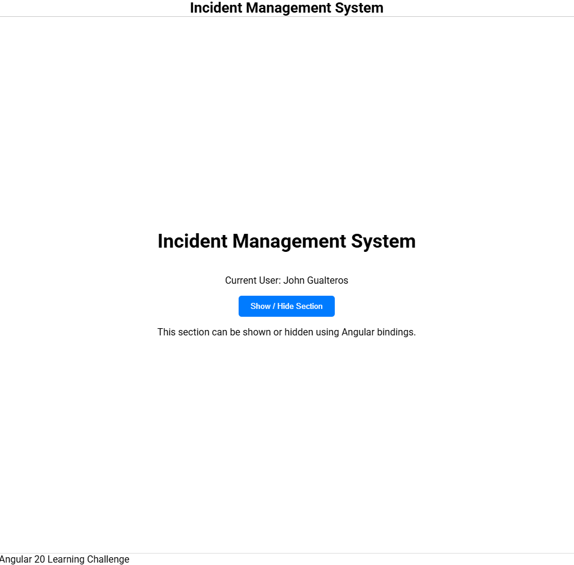
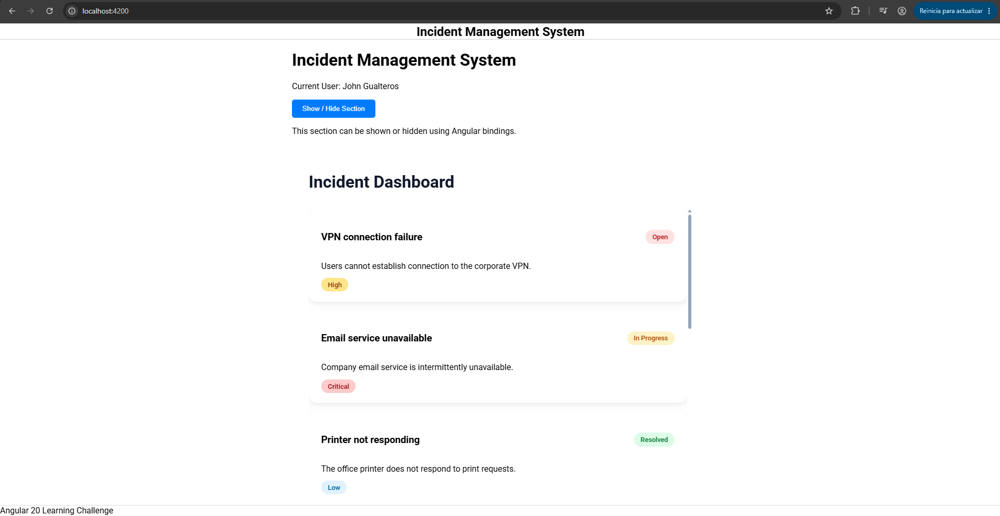
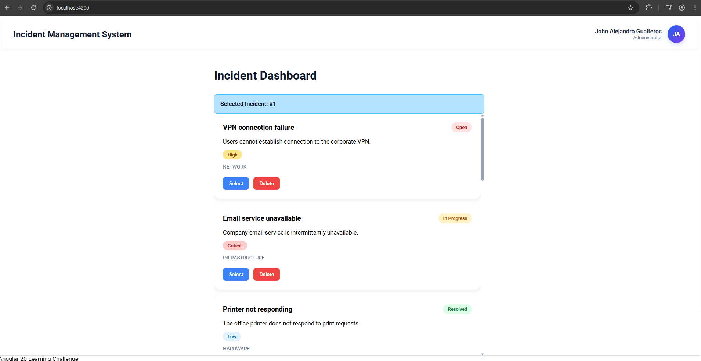
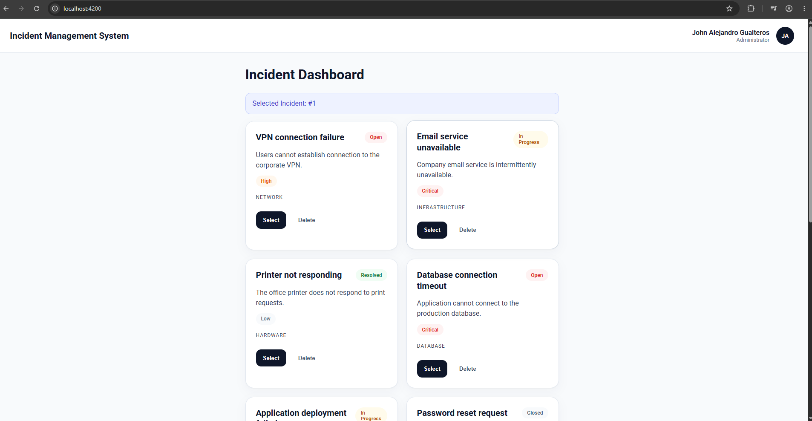

# Angular 20 - Day 1

## Objective

Set up the development environment and understand the initial structure of an Angular 20 application.

## Technologies

- Node.js
- NPM
- Angular CLI 20
- TypeScript
- SCSS
- Git

## Activities Performed

1. Verified installed versions of Node.js and NPM.
2. Installed Angular CLI 20 globally.
3. Created a new Angular project.
4. Enabled TypeScript strict mode.
5. Ran the application locally.
6. Reviewed the generated project structure.
7. Initialized a Git repository.
8. Created the project README file.
9. Documented the main project commands.

## Useful Commands

```bash
node -v
npm -v

npm install -g @angular/cli@20

ng version

ng new incidents_management

cd incidents_management

ng serve
```

## Deliverables

- Angular application running locally.
- Initialized Git repository.
- Project README file.
- Local execution evidence.
- Initial project commit.

## Next Steps

- Step by step with activity 2

______________________________________________________

# Daily Report - Day 2

## Objective of the Day

Apply static typing using TypeScript to define the core domain structures of the Incident Management System while following best practices and avoiding the use of `any`.

## Activities Performed

- Created the `IncidentStatus` type using union types.
- Created the `IncidentPriority` type using union types.
- Created the `UserRole` type.
- Implemented the `User` interface.
- Implemented the `Incident` interface.
- Created the `IncidentSearchCriteria` class.
- Added optional properties using the `?` operator.
- Added immutable properties using the `readonly` keyword.
- Created mock users data.
- Created mock incidents data.
- Organized domain models within the incidents feature module.
- Verified that no `any` type was used.

## Concepts Applied

- Primitive types.
- Arrays.
- Objects.
- Interfaces.
- Type aliases.
- Union types.
- Optional properties.
- Readonly properties.
- Constructors.
- Classes.
- Static typing.
- Domain modeling.

## Functional Evidence

- Initial domain models successfully created.
- Strongly typed mock data available for future features.
- TypeScript compilation completed without type errors.
- Incident management domain structure established.

## Tests Performed

- Verified successful project compilation.
- Validated model imports and dependencies.
- Checked type compatibility between interfaces and mock data.
- Confirmed the absence of the `any` type.
- Validated readonly and optional property definitions.

## Issues Encountered

- Evaluated the use of union types versus enums for domain constants.
- Defined an appropriate folder structure for application models and mock data.

## Solutions Applied

- Selected union types to align with the TypeScript learning objectives of the challenge.
- Organized models inside the `features/incidents` module to maintain a domain-driven structure.
- Separated mock data from domain models to improve maintainability.

## Technical Decisions

- Used interfaces for `User` and `Incident` because they represent data contracts.
- Used type aliases and union types to restrict status, priority, and role values.
- Used a class for `IncidentSearchCriteria` because it may later contain validation or helper logic.
- Kept mock data isolated from business models.

## Pending Work

- Implement typed functions with explicit parameter and return types.
- Create services to manage incident data.
- Implement incident listing functionality.
- Continue with the next activities of the Angular 20 learning challenge.

## Time Invested

- Approximately 2 hours. 1 40 aprox

_______________________________________________________

# Daily Report - Day 3

## Objective of the Day

Understand the structure and responsibility of an Angular component by creating standalone components and implementing basic component interaction.

## Activities Performed

- Created the Header component.
- Created the Footer component.
- Created the Home component.
- Configured standalone component imports.
- Displayed the system title using interpolation.
- Displayed a simulated user name.
- Implemented a button to show and hide a section.
- Implemented event binding for user interaction.
- Implemented property binding to control visibility.
- Composed the application using reusable components.

## Concepts Applied

- Component decorator.
- Selector.
- Template.
- Stylesheet.
- Standalone components.
- Interpolation.
- Property binding.
- Event binding.
- Component composition.

## Functional Evidence

- Header component successfully implemented.
- Footer component successfully implemented.
- System title displayed through interpolation.
- Simulated user displayed on screen.
- Section visibility controlled through user interaction.
- Application successfully composed using standalone components.

**Screenshot:**



## Tests Performed

- Verified application rendering.
- Tested component composition.
- Verified interpolation functionality.
- Tested property binding behavior.
- Tested event binding functionality.
- Verified show/hide interaction.

## Issues Encountered

- Defining a scalable structure for reusable and feature-specific components.
- Determining the appropriate placement for layout-related components.

## Solutions Applied

- Placed Header and Footer components inside the shared module because they are reusable across multiple features.
- Kept page-specific functionality inside the Home feature.
- Used standalone components to simplify dependency management.

## Technical Decisions

- Used standalone components for all new components.
- Separated reusable layout components from feature-specific functionality.
- Managed component events directly from TypeScript.
- Avoided complex logic inside templates.

## Pending Work

- Create additional feature components.
- Implement routing.
- Start building incident-related screens.
- Continue applying Angular component best practices.

## Time Invested

- Approximately 2 hours.

________________________________________________________

# Daily Report - Day 4

## Objective of the Day

Render dynamic incident data using Angular's modern control flow syntax and improve the visual presentation of the application through responsive layouts and custom styling.

## Activities Performed

- Created the Incident List component.
- Implemented incident rendering using the `@for` directive.
- Configured a stable tracking expression using `track incident.id`.
- Implemented conditional rendering with `@if` and `@else`.
- Added an empty state using the `@empty` directive.
- Implemented status visualization using the `@switch` directive.
- Added visual indicators for incident priorities.
- Integrated mock incident data into the component.
- Added a custom scrollbar for the incident list container.
- Implemented a modern card-based layout for displaying incidents.
- Created and executed component tests.
- Configured zoneless testing support using `provideZonelessChangeDetection()`.

## Concepts Applied

- Angular Control Flow.
- `@for`.
- `@if`.
- `@else`.
- `@empty`.
- `@switch`.
- Tracking expressions.
- Conditional rendering.
- Standalone components.
- Component testing.
- Zoneless Change Detection.
- SCSS styling.
- Responsive layouts.

## Functional Evidence

- Dynamic incident list successfully rendered from mock data.
- Incident statuses displayed using the `@switch` directive.
- Incident priorities visually differentiated through custom styles.
- Empty state successfully implemented.
- Stable tracking configured using incident identifiers.
- Modern card-based interface implemented.
- Custom scrollbar successfully applied.
- Component tests executed successfully.

**Screenshot:**



## Tests Performed

- Verified successful rendering of the incident list.
- Verified incident tracking using `track incident.id`.
- Validated status and priority visualization.
- Verified empty state rendering.
- Executed component creation tests.
- Verified mock data loading.
- Verified incident collection size.
- Verified existence of open incidents.
- Verified existence of critical incidents.

## Issues Encountered

- Scroll behavior was not working as expected due to container sizing constraints.
- Component tests failed because Angular zoneless configuration was not provided during TestBed initialization.
- Determining the most appropriate layout structure for displaying larger incident collections.

## Solutions Applied

- Added proper height constraints and overflow configuration to the incident container.
- Configured `provideZonelessChangeDetection()` inside the testing module.
- Implemented a scrollable card-based layout to improve usability.
- Added a custom-styled scrollbar to provide a more polished user experience.

## Technical Decisions

- Used Angular's modern control flow syntax instead of legacy structural directives.
- Used `track incident.id` to provide stable item tracking.
- Kept incident-related functionality inside the incidents feature module.
- Reused mock data from previous activities to maintain consistency.
- Applied SCSS component encapsulation for styling.
- Maintained a zoneless Angular application architecture.

## Pending Work

- Implement application routing.
- Create incident detail views.
- Add filtering and search capabilities.
- Introduce Angular services for data management.
- Begin API integration preparation.

## Time Invested

- Approximately 3 hours.

____________________________________________________________

# Daily Report - Day 5

## Objective of the Day

Implement parent-child communication using Angular's modern component APIs while applying separation of responsibilities between container and presentation components.

## Activities Performed

- Created the IncidentCardComponent.
- Implemented a required input using `input.required()`.
- Implemented output events using `output()`.
- Added incident selection functionality.
- Added incident deletion functionality.
- Configured event emission from child to parent components.
- Moved incident presentation logic into a reusable card component.
- Kept incident collection management inside the container component.
- Refactored the incident list to render reusable incident cards.
- Implemented a selected incident indicator.
- Added action buttons for incident selection and removal.
- Added a user avatar to the application header.
- Implemented dynamic user initials generation using a TypeScript getter.
- Enhanced the header layout with a modern dashboard-style design.

## Concepts Applied

- Parent-child communication.
- Required inputs.
- Outputs.
- Event emission.
- Container components.
- Presentational components.
- Component reusability.
- Data immutability.
- Getter accessors.
- Component composition.
- Standalone components.
- SCSS styling.

## Functional Evidence

- IncidentCardComponent successfully created as a reusable presentation component.
- Parent component successfully manages the incident collection.
- Child component emits selection events.
- Child component emits deletion events.
- Selected incidents are correctly identified by the container component.
- Incidents can be removed from the collection through event communication.
- User avatar successfully displays generated initials.
- Header component enhanced with user information and avatar visualization.
- Application structure follows container and presentational component separation.

**Screenshot:**



## Tests Performed

- Verified required input binding.
- Verified output event emission.
- Verified parent-child communication flow.
- Verified incident selection functionality.
- Verified incident deletion functionality.
- Verified collection updates after deletion.
- Verified selected incident tracking.
- Verified avatar initials generation.
- Verified reusable card rendering.

## Issues Encountered

- Determining the correct responsibility boundaries between the parent and child components.
- Preserving the visual logic implemented during Day 4 while introducing component communication.
- Designing a reusable card component without exposing collection management responsibilities.

## Solutions Applied

- Moved incident visualization logic into the IncidentCardComponent.
- Kept collection mutations exclusively inside the container component.
- Implemented outputs for selection and deletion actions.
- Preserved status and priority visualization within the presentation component.
- Implemented a getter accessor to calculate avatar initials from the current user name.

## Technical Decisions

- Used `input.required()` instead of the traditional `@Input()` decorator.
- Used `output()` instead of the traditional `@Output()` decorator.
- Followed Angular's container/presentation component pattern.
- Prevented the child component from mutating input data directly.
- Kept state management inside the parent component.
- Reused Day 4 card styling within the new reusable component.
- Implemented avatar initials generation through a getter due to its simplicity and low computational cost.

## Pending Work

- Implement application routing.
- Create incident detail views.
- Add filtering capabilities.
- Introduce Angular services for state management.
- Continue improving component reusability.
- Prepare the application for API integration.

## Time Invested

- Approximately 2 hours 30 mins.

________________________________________________________________________________

# Daily Report - Day 6

## Objective of the Day

Improve the application's visual design, responsiveness, and accessibility by applying modern UI principles, reusable styling conventions, and responsive layouts.

## Activities Performed

- Defined global CSS variables for colors, spacing, shadows, and border radius.
- Refactored component styling to use a centralized design system.
- Improved the visual hierarchy of the dashboard interface.
- Redesigned incident cards using a more modern and minimalist appearance.
- Refined status and priority indicators using softer color palettes.
- Enhanced the header component with a cleaner user profile section.
- Improved avatar presentation and user information display.
- Created a responsive card grid using CSS Grid.
- Added responsive behavior for mobile devices.
- Implemented hover states for interactive elements.
- Implemented focus states for keyboard accessibility.
- Implemented disabled states for interactive controls.
- Improved card alignment and visual consistency across different content lengths.
- Standardized spacing and typography throughout the application.
- Reduced visual noise by simplifying button styling and color usage.

## Concepts Applied

- CSS Variables.
- Component Style Encapsulation.
- CSS Grid.
- Flexbox.
- Responsive Design.
- Mobile-first Adaptation.
- Visual Hierarchy.
- Accessibility.
- Focus States.
- Hover States.
- Disabled States.
- Design System Principles.
- Semantic Styling.

## Functional Evidence

- Responsive incident dashboard successfully implemented.
- Consistent design system applied across all components.
- Incident cards display with improved visual hierarchy.
- Responsive grid adapts correctly to different screen sizes.
- Keyboard focus indicators successfully implemented.
- Interactive elements provide visual feedback through hover and focus states.
- Card alignment improved for incidents with varying description lengths.
- Header component enhanced with a cleaner and more professional appearance.
- User avatar integrated into the overall visual system.

**Screenshot:**



## Tests Performed

- Verified responsive behavior on desktop resolution.
- Verified responsive behavior on mobile resolution.
- Tested keyboard navigation using focus states.
- Tested button hover interactions.
- Verified disabled state styling.
- Validated card alignment consistency.
- Verified incident grid responsiveness.
- Confirmed accessibility improvements for interactive controls.

## Issues Encountered

- Cards displayed inconsistent heights due to different content lengths.
- Initial design appeared visually overloaded with excessive color emphasis.
- Achieving a balance between visual appeal and usability required several design iterations.
- Maintaining consistency between reusable components after style refactoring.

## Solutions Applied

- Applied flexible card layouts to improve visual consistency.
- Introduced a unified design system through CSS variables.
- Reduced color saturation and emphasized neutral tones.
- Improved spacing and typography to strengthen visual hierarchy.
- Implemented responsive grid behavior for different screen sizes.
- Added accessibility-focused interaction states for buttons and controls.

## Technical Decisions

- Centralized design tokens using CSS variables.
- Applied a minimalist visual approach inspired by modern SaaS dashboards.
- Used CSS Grid for responsive card layouts.
- Used Flexbox for component-level alignment.
- Preserved component style encapsulation.
- Implemented accessibility improvements without introducing external UI libraries.
- Prioritized consistency and readability over decorative styling.
- Maintained a lightweight styling approach using native SCSS features.

## Pending Work

- Implement Angular routing.
- Create incident detail views.
- Add filtering and search capabilities.
- Introduce service-based data management.
- Improve accessibility with ARIA attributes where appropriate.
- Continue refining the overall user experience.

## Time Invested

- Approximately 1 hour 30 mins.
